<p align="center">

</p>

## 介绍 🦉
-  **[English](https://github.com/Eplankton/mos-renode) | [中文](https://gitee.com/Eplankton/mos-renode)**

**MOS** 是一个实时操作系统（RTOS）项目，包含一个抢占式内核和简易命令行(使用C++编写), 并移植了一些应用层组件(例如，**GuiLite** 和 **FatFS**)。

## 仓库 📦
- **[Gitee(中文)](https://gitee.com/Eplankton/mos-core) | [GitHub(English)](https://github.com/Eplankton/mos-core)**

## 架构 🏀


```
.
├── config.h             // 系统配置
├── 📁 arch              // 架构相关
│   └── cpu.hpp          // 初始化/上下文切换
│
├── 📁 kernel            // 内核代码
│   ├── macro.hpp        // 常量宏
│   ├── type.hpp         // 基础类型
│   ├── concepts.hpp     // 类型约束(可选)
│   ├── data_type.hpp    // 基本数据结构
│   ├── alloc.hpp        // 内存管理
│   ├── global.hpp       // 内核全局变量
│   ├── printf.h/.c      // 线程安全的 printf(*)
│   ├── task.hpp         // 任务控制
│   ├── sync.hpp         // 同步原语
│   ├── async.hpp        // 异步协程
│   ├── scheduler.hpp    // 调度器
│   ├── ipc.hpp          // 进程间通信
│   └── utils.hpp        // 其他工具
│
├── kernel.hpp           // 内核模块
└── shell.hpp            // 命令行
```

<p align="center">

</p>